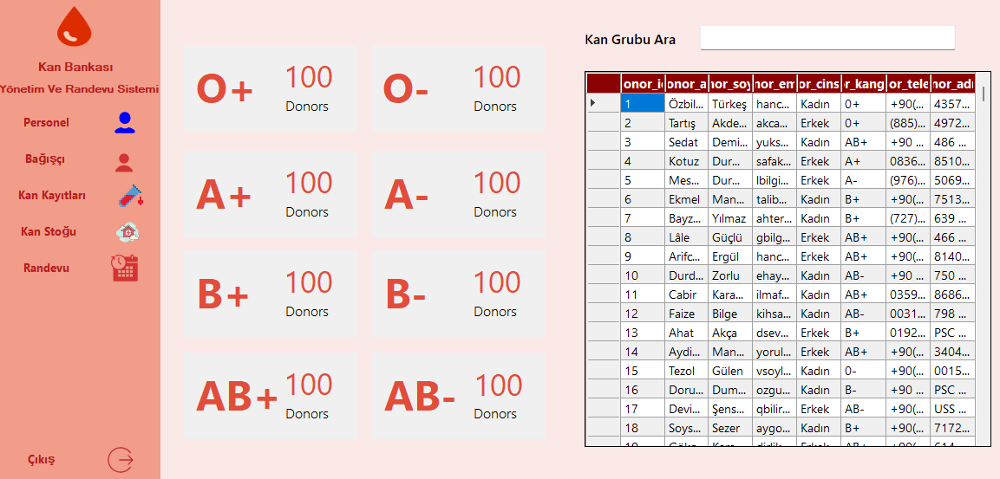
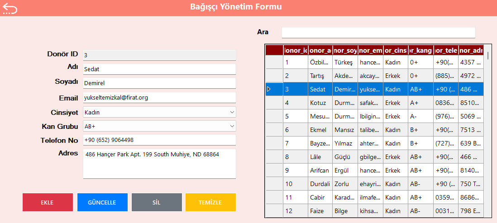
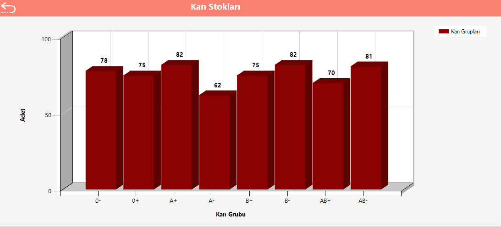

# 🩸 Kan Bankası Otomasyon Sistemi

Bu proje, kan bağışı ve kan stoğu yönetimini kolaylaştırmak amacıyla geliştirilmiş bir **Kan Bankası Otomasyon Sistemidir**. Hastane personeli, gönüllü bağışçılar ve yöneticiler için çeşitli modüller içerir.

## 🚀 Özellikler

- ✅ Kan bağışı kayıtları
- ✅ Donör ve personel yönetimi
- ✅ Kan grubu bazlı filtreleme
- ✅ Otomatik stok takibi
- ✅ Sorgulama ve raporlama ekranları
- ✅ Modern ve kullanıcı dostu arayüz

## 🖼️ Ekran Görüntüleri

### Ana Sayfa


### Donör Kayıt Ekranı


### Stok Takip Paneli


## 🛠️ Kullanılan Teknolojiler

- **C#** (.NET Framework / .NET Core)
- **MySQL** (veritabanı)
- **MySQL Connector/NET**
- **Guna UI**
- **Visual Studio** (IDE)

## 📁 Kurulum

1. Bu projeyi klonlayın veya ZIP olarak indirin:
 

2. Visual Studio ile projeyi açın.

3. MySQL veritabanınızı oluşturun ve `bloodbank.sql` dosyasını çalıştırarak tablolaları oluşturun.

4. Projeyi başlatın (`F5` tuşuna basarak).

---
   ```


📌 Geri bildirim, katkı ya da sorun bildirimleri için pull request gönderebilirsiniz!
